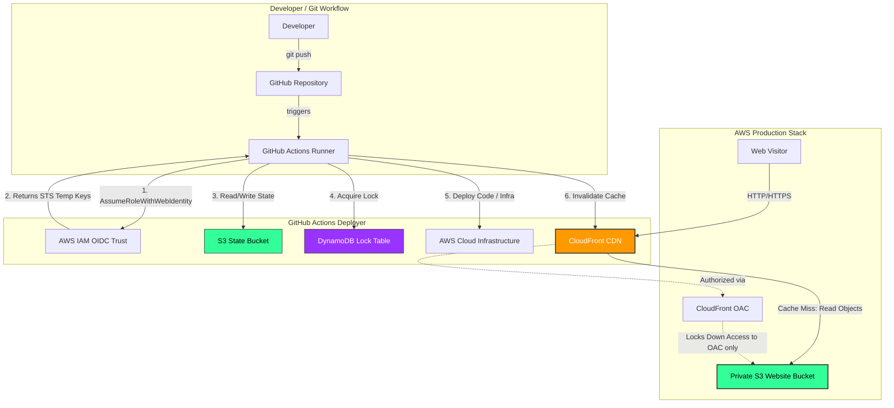

# Terraformed 🛠️ — Enterprise-Grade CI/CD Static Web Infrastructure

[](https://github.com/GeekKwame/terraf6r0ed--r61ect/actions/workflows/deploy.yml)


A cloud engineering practice project implementing modern infrastructure-as-code (IaC) and automation workflows. This project provisions a highly secure, private AWS S3 bucket serving static landing page assets behind a CloudFront Content Delivery Network (CDN) distribution, fully managed via GitHub Actions with OpenID Connect (OIDC) authentication.

---

## 📐 System Architecture

The following diagram illustrates the complete infrastructure deployment and user access flows:



---

## 🔒 Key Design Decisions & Security Controls

* **Zero Static Secrets (AWS OIDC)**: Instead of storing sensitive, long-lived AWS Access Keys inside GitHub Repository Secrets, the CI/CD pipeline uses OpenID Connect (OIDC). On every run, GitHub Actions requests short-lived, temporary session credentials from AWS Security Token Service (STS) using a secure trust relationship bound strictly to this repository.
* **Origin Access Control (OAC)**: The S3 origin bucket is completely private, blocking all public access. The CloudFront CDN distribution uses AWS Origin Access Control to sign requests, ensuring that the S3 bucket only serves objects requested through CloudFront. Users cannot bypass the CDN or access the origin directly.
* **Remote State Management & Locking**: S3 remote state storage tracks resources across local and remote executions. S3 bucket versioning is enabled to allow rollbacks, and a DynamoDB locking table prevents concurrent executions from corrupting state files.
* **Smart Content-Type Guessing**: During deployment, files uploaded to S3 are automatically inspected and assigned appropriate MIME-types (HTML, CSS, JS, SVG, JPG, etc.) rather than the default `application/octet-stream`, ensuring proper rendering on client browsers.

---

## 📸 Deployment & Console Snapshots

The deployment details, successful automation, and verified AWS configurations are documented in the [proj-snapshots/](file:///c:/Users/eddie/OneDrive/Documents/terraformed-project/proj-snapshots) directory:

| Snapshot / Proof-of-Work Description | Path |
| --- | --- |
| Deployed Website Landing Page Preview | [Website Preview](file:///c:/Users/eddie/OneDrive/Documents/terraformed-project/proj-snapshots/Screenshot%202026-07-05%20224542.png) |
| Successful GitHub Actions Deployment Pipeline Run | [Actions Run Summary](file:///c:/Users/eddie/OneDrive/Documents/terraformed-project/proj-snapshots/Screenshot%202026-07-05%20224552.png) |
| AWS S3 Console showing the Website & State Buckets | [S3 Buckets List](file:///c:/Users/eddie/OneDrive/Documents/terraformed-project/proj-snapshots/Screenshot%202026-07-05%20224319.png) |
| AWS CloudFront Configuration Details | [CloudFront Config](file:///c:/Users/eddie/OneDrive/Documents/terraformed-project/proj-snapshots/Screenshot%202026-07-05%20224300.png) |
| AWS DynamoDB Table for Terraform State Locks | [DynamoDB Lock Table](file:///c:/Users/eddie/OneDrive/Documents/terraformed-project/proj-snapshots/Screenshot%202026-07-05%20224241.png) |
| GitHub Actions Workflow Run logs (Terraform Plan) | [Workflow plan logs](file:///c:/Users/eddie/OneDrive/Documents/terraformed-project/proj-snapshots/Screenshot%202026-07-05%20224209.png) |
| GitHub Actions Workflow Run logs (Terraform Apply) | [Workflow apply logs](file:///c:/Users/eddie/OneDrive/Documents/terraformed-project/proj-snapshots/Screenshot%202026-07-05%20224155.png) |
| AWS IAM OIDC Identity Provider setup | [OIDC Provider Setup](file:///c:/Users/eddie/OneDrive/Documents/terraformed-project/proj-snapshots/Screenshot%202026-07-05%20224148.png) |
| AWS IAM Trust Relationship Policy configuration | [IAM Trust Policy](file:///c:/Users/eddie/OneDrive/Documents/terraformed-project/proj-snapshots/Screenshot%202026-07-05%20224130.png) |

---

## 🚀 Quick Start Guide

### Prerequisites
1. Installed **Terraform** (>= 1.5.0).
2. Installed **AWS CLI** configured with administrator credentials.
3. A GitHub repository to run workflows.

### 1. Provision Backend Resources (One-Time Setup)
Create your remote backend state bucket and locking table in your default AWS region:
```bash
# Create the S3 State Bucket (use a globally unique name)
aws s3api create-bucket --bucket your-unique-tfstate-bucket --region us-east-1

# Enable Bucket Versioning
aws s3api put-bucket-versioning --bucket your-unique-tfstate-bucket --versioning-configuration Status=Enabled

# Create the DynamoDB Table for locking
aws dynamodb create-table \
    --table-name terraformed-tf-locks \
    --attribute-definitions AttributeName=LockID,AttributeType=S \
    --key-schema AttributeName=LockID,KeyType=HASH \
    --provisioned-throughput ReadCapacityUnits=1,WriteCapacityUnits=1
```

### 2. Configure Local Workspace
Update the following configurations in the `terraform/` directory:
* **[versions.tf](file:///c:/Users/eddie/OneDrive/Documents/terraformed-project/terraform/versions.tf)**: Update the `backend "s3"` block to point to your new bucket and table.
* **[variables.tf](file:///c:/Users/eddie/OneDrive/Documents/terraformed-project/terraform/variables.tf)**: Change the default value of the `bucket_name` variable to a globally unique name for your website files (different from the state bucket).

Initialize and migrate state:
```bash
cd terraform
terraform init
```

### 3. Deploy Manually (Optional)
```bash
terraform plan
terraform apply --auto-approve
```

---

## 🛠️ GitHub Actions CI/CD Pipeline

The `.github/workflows/deploy.yml` workflow automates deployments on git triggers:
* **Pull Request**: Runs `terraform fmt -check`, initializes the workspace, and runs `terraform plan`.
* **Push to Main**: Runs `terraform init`, `terraform apply --auto-approve`, invalidates the CloudFront Cache to push new assets live instantly, and prints the live website URL.

To link the pipeline:
1. Create an IAM Web Identity role in AWS for GitHub Actions OIDC (see [github_actions_setup.md](file:///C:/Users/eddie/.gemini/antigravity-ide/brain/8e0ea4ab-c0ee-4fc2-a7c5-5ac03d6fac3f/github_actions_setup.md) for details).
2. Add your IAM role ARN to your GitHub repository secrets named `AWS_ROLE_ARN`.

---

## 🧹 Clean Up

To tear down the deployed resources and avoid unexpected AWS charges:
```bash
cd terraform
terraform destroy --auto-approve
```
